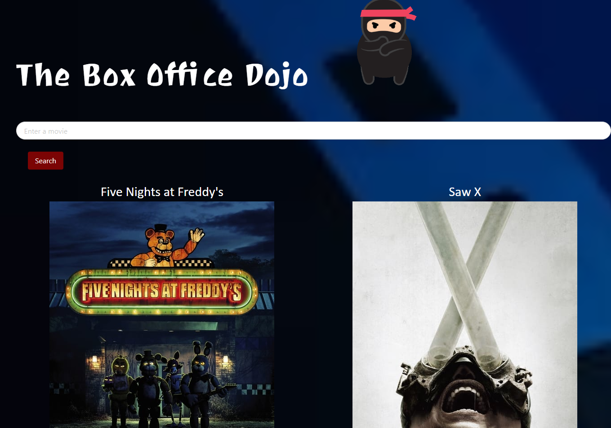

# Box-Office-Dojo

Have you ever thought of all the movies you'd want to watch and just hoping you'll remember the titles AND be able to find them?
  Well, Box Office Dojo is here to help!
  Box Office Dojo is the perfect place to curate your own personal movie watch list.

[A link to the website can be found here.](https://ashleyh5440.github.io/box-office-dojo/)
## How It Works

BOD uses two different API's to function.

The TMDB API is first used to take user input and run it through their database.
  It then displays a list of movies that match either the searched title or genre.
  Users can then click on a movie poster to be shown a short summary, the runtime, and streaming locations.
  A button is also available to add the viewed movie to the user's watchlist.

The GIPHY API is used in concert with the TMDB API, taking that same user input to display several gifs that pertain to searched movies.
  Those gifs will be displayed alongside other data when the user selects a movie for further details.

In addition to the APIs, BOD utilizes localStorage to maintain the watch list as well as a search history.
  Previously searched titles can be called on once again with the simple click of a button.
 The watch list itself is displayed to the side at all times. 
 Users can also navigate to a page dedicated to displaying the watch list as whole.
 The titles on the main page of the watch list are clickable, allowing the user to search details once more whenever they choose.

### Sources
[TMDB API](https://developer.themoviedb.org/docs)
 [GIPHY API](https://developers.giphy.com/)

Streaming services data from TMDB API sourced from [JustWatch](https://www.justwatch.com/).